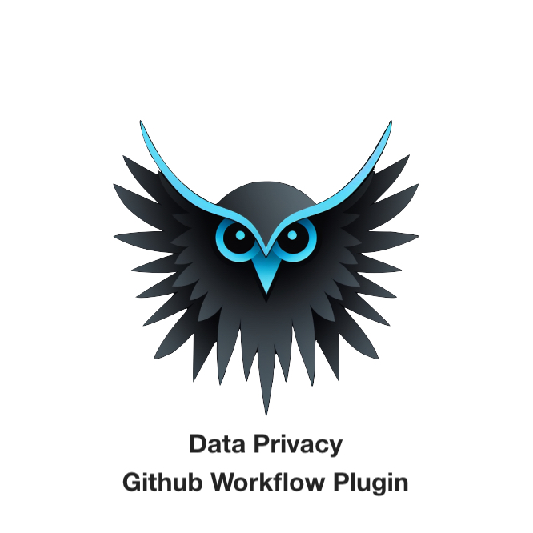

# Documentation on Data Privacy in GitHub Workflow Plugin

### Introduction

The GitHub Workflow Plugin is designed to assist developers in managing GitHub Actions and Workflows directly from their
IDE. As part of its functionalities, it processes and stores certain data. This document outlines the nature of this
data and how we manage it.

### Data Stored Prior to Version 3.0.0

Before version 3.0.0, workflow or action files were stored in plain text on the filesystem.

### Data Management From Version 3.0.0 Onwards

From version 3.0.0 onwards, significant improvements have been made in terms of privacy:

* **On-the-Fly** Processing: All necessary data is processed on-the-fly, minimizing the stored data to only essential
  parts.
* **Cached Data:** The data is stored in the IDE cache, specifically in **githubActionCache.xml**.

### What Data is Stored?

As of version 3.0.0, the plugin caches the following data for each workflow and action:

1) **Uses Value**: The value specified in the `use` field of your workflow file.
2) **Action Status**: A boolean indicating whether the `usesValue` refers to a GitHub Action or a workflow, identified
   through `isAction`.
3) **Local Reference**: A boolean specifying whether the `usesValue` points to a local directory or file, indicated
   by `isLocal`.
4) **Suppression Status**: An internal flag (`isSuppressed`) indicating whether validation for the `usesValue` is
   currently deactivated.
5) **Resolution Status**: An internal flag (`isResolved`) that records if the action or workflow has been successfully
   imported.
6) **Input/Output Variables**: Variables obtained from the corresponding action or workflow.
7) **Guessed Name**: A name extrapolated from the `usesValue`, stored as `name`.
8) **URL Information**: Guessed URLs (`downloadUrl` and `githubUrl`) which are not considered more sensitive than the
   original `usesValue`.

Among these, only the `input` and `output` variables have the potential to be sensitive or private. The level of their
sensitivity depends on your unique data privacy considerations.

### Security Measures

Given that the plugin operates within the same IDE environment where your code resides, the risk profile is generally no
different from working directly with your IDE.

### Future Enhancements for Data Security

While the plugin has made considerable strides in improving data security from version 3.0.0, we are actively looking to
implement further enhancements to offer an even more secure experience for users. One idea could be to encryption the
data.

### Conclusion

While there is a focus on maintaining user privacy and data security, it is important to understand that some data is
stored. However, from version 3.0.0, these have been limited to the least sensitive and most essential pieces of
information, and are processed in a way to minimize privacy risks.
